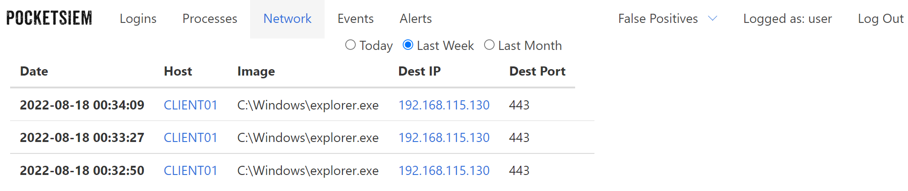
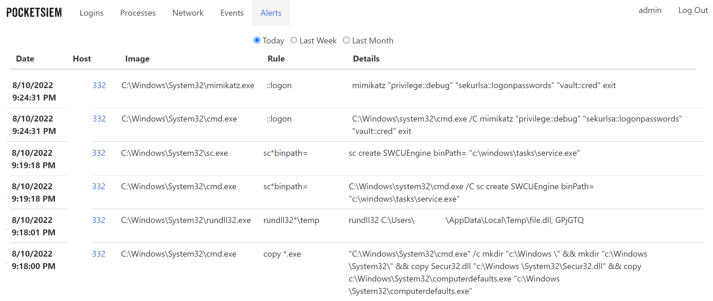

## Windows and Linux security events monitoring and alerting

 The SIEM (security information and event management) implementation for research / CTF usage as an alternative to a full blown ELK / winlogbeat etc setups. The main purpose of the tool is to evaluate the optimal logs volume and malicious patterns sufficient to detect common TTPs, which is often the problem of full size SIEM.

Current functionality includes:

* Aggregating and alerting on suspicious Windows Secuity and Sysmon events (check Client/collector.ps1 for details).
* Logging and monitoring SSH logon attempts on Linux (Client/ssh_logins_psiem.py)
* [Falco](https://falco.org/) alerts visualization
* Functional web interface to work with received logs, grouped by the event type with the host filtering,  appropriate date range, hiding false positives and many more.



* Various detection rules are currently supported. Check `Tweaking alerts` section for details.



### Server setup

* Ensure you have [docker](https://docs.docker.com/engine/install/) and [docker-compose](https://docs.docker.com/compose/install/other/) installed.
* Run from the PocketSIEM folder:

```
sudo docker-compose up -d
```

* View the log to get the `admin` password:

```
cat services/server/pocketsiem.log | grep password
```

* Login to the website with `admin` user and obtain client JWT by visiting `/token`

### Windows client setup:

* Download [Sysmon](https://download.sysinternals.com/files/Sysmon.zip)
* Install `Sysmon64.exe -i Client\sysmonconfig.xml`
* Amend the `$url` to your API server IP / Address in `Client\collector.ps1`
* Fill in the generated JWT value.
* Add the user to the `Event Log Readers` group:

```
net localgroup "Event Log Readers" YOUR_USER /add
```

* Give the user read permissions to the Security registry hive regedit -> Computer\HKEY_LOCAL_MACHINE\SYSTEM\CurrentControlSet\Services\EventLog\Security -> Right click on Security -> Permissions -> Add your user
* Create scheduled task to periodically run `Client\collector.ps1`. From command line might be quicker:

```
SCHTASKS /CREATE /SC HOURLY /TN "PocketSIEM" /TR "powershell.exe -w hidden C:\Path\Client\collector.ps1"
```

### Linux client setup:

Configure [Falco](https://falco.org/docs/getting-started/falco-linux-quickstart/) on your host.

Alternalively execute `falco-psiem.sh` from the Client folder. Check the script contents to understand what it does and consult Falco documentation for the setup parameters.

To send SSH logon attempts from your hosts:
* Execute `ssh-psiem.sh` from the Client folder.

### (Optional) Generate server SSL keys

Although the server will work with embedded SSL keys one may want to generate own pair. One way of doing that is to use Let's Encrypt with the registered domain for that.

```
sudo snap install certbot --classic
sudo certbot certonly --register-unsafely-without-email --agree-tos -d mydomain.com
```

Copy generated SSL keys and certificates in `services/nginx/certs` folder. Run the following commands providing your domain name:

```
export MYDOMAIN=mydomain.com
sudo cp /etc/letsencrypt/live/$MYDOMAIN/privkey.pem services/nginx/certs/key.pem
sudo cp /etc/letsencrypt/live/$MYDOMAIN/fullchain.pem services/nginx/certs/cert.pem
```

For testing purposes, it is possible to use own generated certificate. To generate the self-signed pair:

```
cd services/nginx/certs
openssl req -x509 -newkey rsa:4096 -nodes -out cert.pem -keyout key.pem -days 365
```

### Tweaking alerts:

Several rule files are maintained by the project. The simple rules list stored here `services/server/detect/rules/rules_simple.txt` aiming to detect malicious patterns in the process command line, created files, registry modifications and other log details fields. 

Feel free to add or remove patterns. Star `*` means both strings should be in the log details to raise an alert. `%` is an antipattern to exclude. Example:

```
- '.exe*.dll,%rundll32'
```

Here if any `.exe` file is executed with `.dll,` pattern in the parameters, the alert will be raised, unless the executable is `rundll32` In this example we are catching the technique when dlls are executed with renamed rundll32.