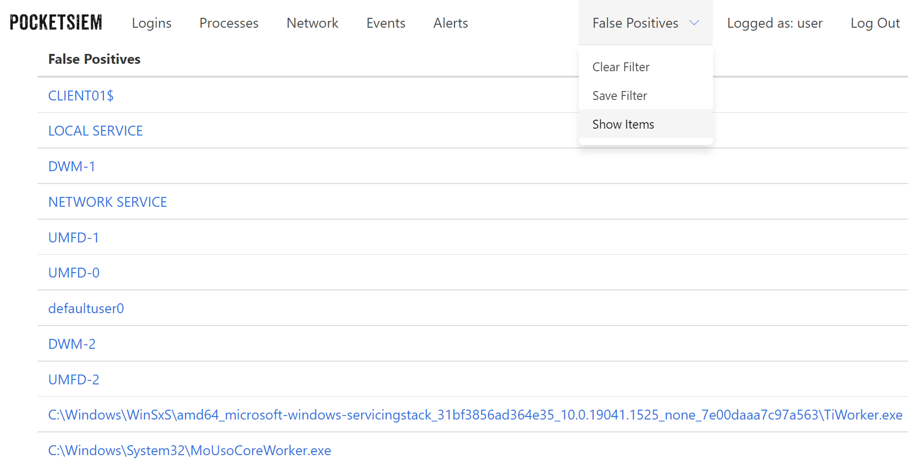

## Windows and Linux security events monitoring and alerting

 The SIEM (security information and event management) implementation for research / CTF usage as an alternative to a full blown ELK / winlogbeat etc setups. The main purpose of the tool is to evaluate the optimal logs volume and malicious patterns sufficient to detect common TTPs, which is often the problem of full size SIEM.

Current functionality includes:

* Powershell agent parses logon attempts and Sysmon events (check Client/collector.ps1 for details).
* Python agent parses SSH logon attempts on Linux
* Agents send logs to the API over HTTPS with JWT authentication.
* Nice web application to work with received logs, grouped by the event type with the host filtering and appropriate date range.
* User sign up and log in possible to view the logs.


* Incoming logs are checked against known evil patterns and an alert is generated on match.
* Sigma and custom rules are currently supported. Check `Tweaking alerts` section for details.


* Log records could be added to or excluded from the false positives filter. Just click on the unwanted binary, user or destination IP.



### Server setup

* Ensure you have [docker](https://docs.docker.com/engine/install/) and [docker-compose](https://docs.docker.com/compose/install/other/) installed.
* Run from the PocketSIEM folder:

```
sudo docker-compose up -d
```

* View the log to get the `admin` password:

```
cat services/server/pocketsiem.log | grep password
```

* Login to the website with `admin` user and obtain client JWT by visiting `/token`

### Windows client setup:

* Download [Sysmon](https://download.sysinternals.com/files/Sysmon.zip)
* Install `Sysmon64.exe -i Client\sysmonconfig.xml`
* Amend the `$url` to your API server IP / Address in `Client\collector.ps1`
* Fill in the generated JWT value.
* Create scheduled task to periodically run `Client\collector.ps1`. Tick "Run with highest privileges" in the created task. From command line might be quicker, don't forget to start cmd as administrator:

```
SCHTASKS /CREATE /SC HOURLY /TN "PocketSIEM" /TR "powershell.exe -w hidden C:\Path\Client\collector.ps1" /RL HIGHEST
```

### Linux client setup:

* Add the server url and token to Client\ssh_logins_psiem.py
* Add the following cron job for sudo user:

```
python3 /your_path/ssh_logins_psiem.py all all off
```

### (Optional) Generate server SSL keys

Although the server will work with embedded SSL keys one may want to generate own pair. One way of doing that is to use Let's Encrypt with the registered domain for that.

```
sudo snap install certbot --classic
sudo certbot certonly --register-unsafely-without-email --agree-tos -d mydomain.com
```

Copy generated SSL keys and certificates in `services/nginx/certs` folder. Run the following commands providing your domain name:

```
export MYDOMAIN=mydomain.com
sudo cp /etc/letsencrypt/live/$MYDOMAIN/privkey.pem services/nginx/certs/key.pem
sudo cp /etc/letsencrypt/live/$MYDOMAIN/fullchain.pem services/nginx/certs/cert.pem
```

For testing purposes, it is possible to use own generated certificate. To generate the self-signed pair:

```
cd services/nginx/certs
openssl req -x509 -newkey rsa:4096 -nodes -out cert.pem -keyout key.pem -days 365
```

### Tweaking alerts:

Several rule files are maintained by the project. The simple rules list stored here `services/server/detect/rules/rules_simple.txt` aiming to detect malicious patterns in the process command line, created files, registry modifications and other log details fields. 

Feel free to add or remove patterns. Star `*` means both strings should be in the log details to raise an alert. `%` is an antipattern to exclude. Example:

```
- '.exe*.dll,%rundll32'
```

Here if any `.exe` file is executed with `.dll,` pattern in the parameters, the alert will be raised, unless the executable is `rundll32` In this example we are catching the technique when dlls are executed with renamed rundll32.